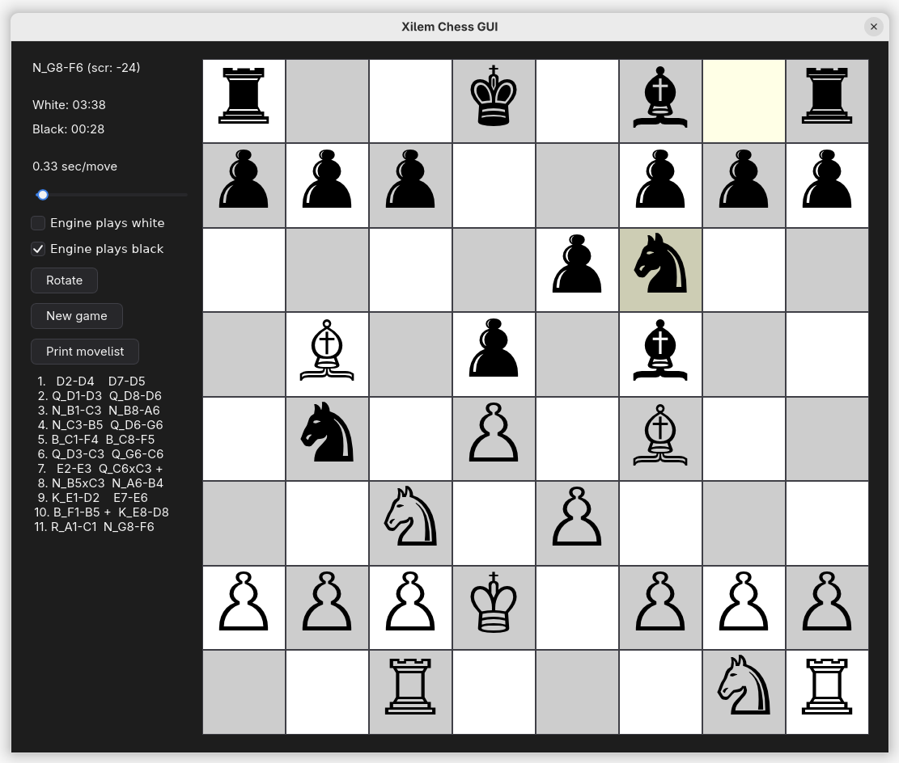

# xilem-chess

A chess interface powered by the Xilem GUI framework for the lightweight Salewski Chess Engine.


## ✨ Overview

`xilem-chess` is a Rust-based chess GUI built with [Xilem](https://github.com/linebender/xilem), a declarative UI toolkit.
It connects to the compact “Salewski chess engine” and displays a clean, responsive chessboard with live engine moves handled through multi-threading and message passing.

**Key highlights:**

* Unicode chess piece rendering
* Play modes for Player vs Engine and Engine vs Engine
* Adjustable engine move timing
* Move highlighting for suggestions and last moves
* A simple (inacurate) chess clock
* Display of movelist, and option to print the list in the terminal
* Thread-safe engine communication via Rust’s `mpsc` channels

---

## 🚀 Features

* ✅ Fully interactive chessboard
* ✅ Customizable seconds-per-move for the engine
* ✅ Board rotation toggle
* ✅ Move list output to the terminal
* ✅ Responsive board built with Xilem’s flex/grid system
* ⚠️ Only click-to-move input (no drag-and-drop yet)
* ⚠️ No save/load or PGN export functionality
* ❌ Dynamic scaling and window title updates are not yet supported by Xilem

---

## 📦 Requirements

* Rust 1.78+ (2024 edition)
* [Xilem](https://github.com/linebender/xilem) (latest from GitHub)
* [masonry](https://github.com/linebender/xilem/tree/main/masonry) for layout
* `tokio`, `num-traits`, `winit` for async and platform integration

Chess pieces are drawn using Unicode symbols. Most systems already have suitable fonts, but the Google font **Noto Sans Symbols** is bundled and used by default (under Google’s copyright).

---

## 🔧 Build & Run

```bash
git clone https://github.com/stefansalewski/xilem-chess.git
cd xilem-chess
cargo run --release
```

When you have a system font with chess pieces support, you can use `features=useSystemFont` to use it instead of the bundled Noto font.

You can install the game like other Rust tools with

```bash
cargo install --path .
# or cargo install --features=useSystemFont --path .
```

When launched, the left panel provides game controls; the right displays the interactive board.

---

## 🕹️ Controls

| Control                | Action                                        |
| ---------------------- | --------------------------------------------- |
| **Engine plays White** | Enable/disable engine control of white pieces |
| **Engine plays Black** | Enable/disable engine control of black pieces |
| **Rotate**             | Flip the board’s orientation                  |
| **New game**           | Reset to starting position                    |
| **Print movelist**     | Output move history to terminal               |
| **Sec/move**           | Adjust engine’s thinking time per move        |

Moves are made by clicking a piece’s square, then its destination square.

---

## 🧠 Internal Design

* **`AppState`** — manages the board, settings, and UI state
* **`engine::Game`** — contains chess rules and logic
* **Threaded messaging** — `task(...)` with `mpsc::Receiver<Move>` for engine responses
* **`engine_to_board(...)`** — converts engine’s internal state to UI data structures
* **UI layout** — composed using Xilem’s `grid`, `button`, `checkbox`, `label`, etc.

---

## 📱 Platform Compatibility

* ✅ Linux (X11 and Wayland)
* ✅ Windows (expected to run without issues)
* ⚠️ macOS (not tested, should work)
* ⚠️ Android (`android_main`, experimental)

---

## ❗ Known Gaps

* No dynamic widget scaling or runtime window title changes
* Missing promotion UI, PGN handling, and drag-and-drop support

---

## 🧪 Developer Notes

This UI was inspired by the `stopwatch.rs` and `calc.rs` examples from Xilem, as well as the previous egui-based `tiny-chess`.
The focus is on keeping engine logic separate from UI state for maintainability.

Debug mode:

```bash
RUST_LOG=debug cargo run
```

The GUI uses currently always the latest Xilem version from GitHub, so from time to time tiny code changes might be required.

---

## 🔄 Alternative Interfaces

The same engine code can be used with:

* **Egui UI** — [https://github.com/StefanSalewski/tiny-chess](https://github.com/StefanSalewski/tiny-chess)
* **3D Bevy UI** — [https://github.com/StefanSalewski/Bevy-3D-Chess](https://github.com/StefanSalewski/Bevy-3D-Chess)

Older Nim, GTK, and blocking egui versions are now deprecated and will be removed.

---

## 📄 License

Copyright © 2015–2032 Dr. Stefan Salewski
Licensed under MIT or Apache 2.0 (same as Rust).

Bundled font: [Noto Sans Symbols 2](https://fonts.google.com/noto/specimen/Noto+Sans+Symbols+2) — see [Google’s license](https://fonts.google.com/noto/specimen/Noto+Sans+Symbols+2/license) for details.

---

